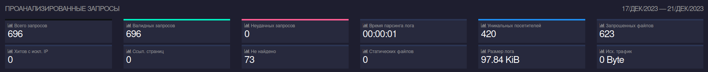
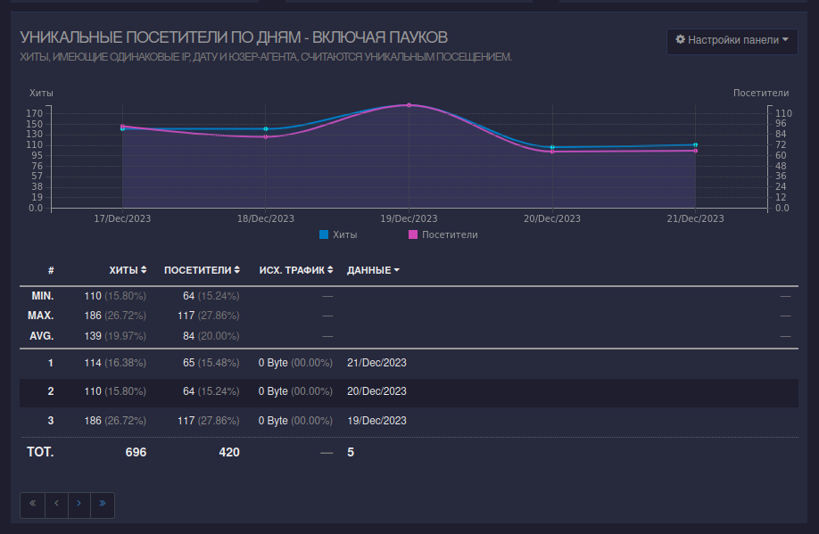
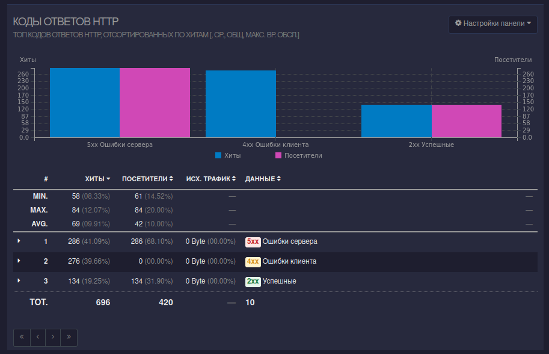
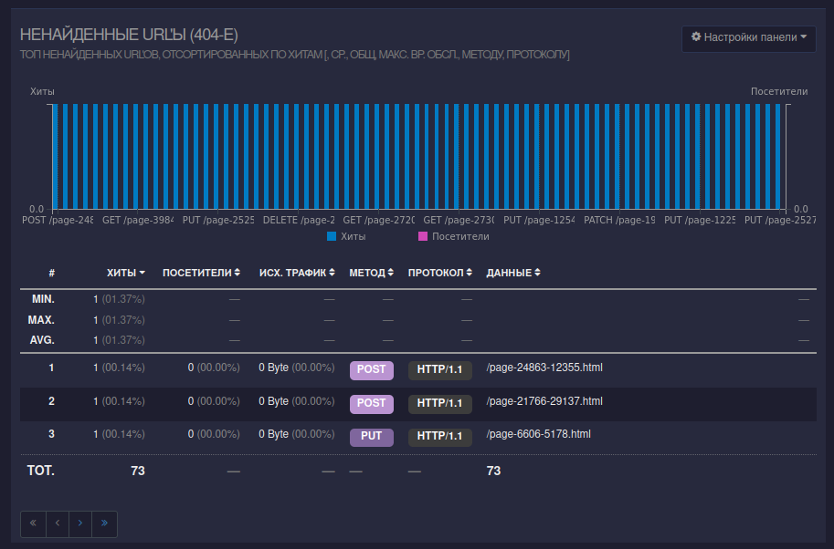

# GoAccess

## Installation

`sudo apt update; sudo apt install goaccess -y`

## Running

The code is located in `main.sh`

## All records

## All unique IPs appearing in records

## All requests

## All unique IPs that appear among error requests

## Also in the tool

In the tool, you can also view a list of all requested URLs, static requests, hostnames and IP addresses of visitors, operating systems, browsers, time distribution, referring sites, and remote users.
