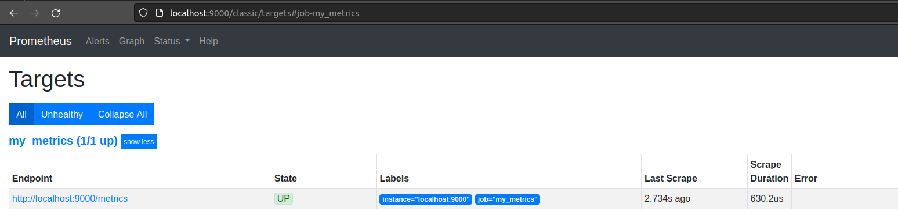
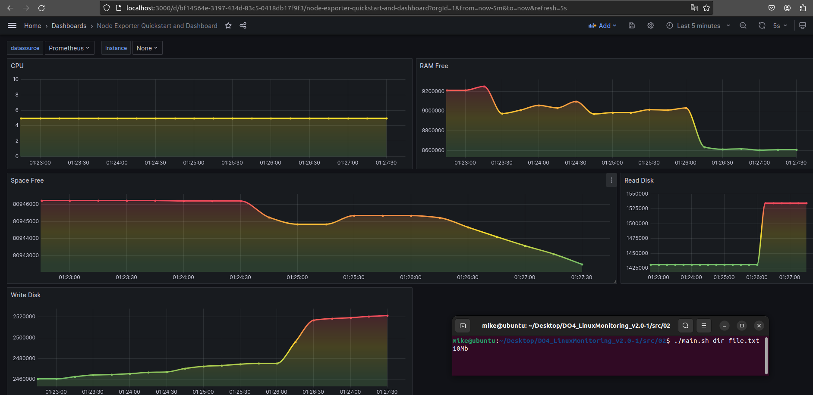
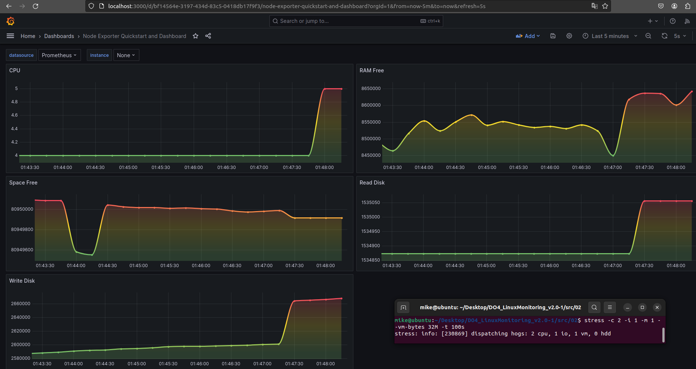

# Custom node_exporter

## main.sh script

The script code can be seen in the file

The script must be run as a superuser because the recording is done in the `index.html` file in the `nginx` folders

## Modify prometheus.yml

Add the following lines:

```bash
  - job_name: my_metrics
    static_configs:
      - targets: ['localhost:9000']
```

And comment out the other `job` lines

## Edit nginx.conf

Make the server output on port `9000`

Set the website folder to `/usr/share/nginx/html`

Make `/` display Prometheus for convenience

Make `/metrics` output our script

## Next

Restart the `prometheus` and `grafana` services

## What I got



## Running the script from Assignment 2



## Running the stress test


